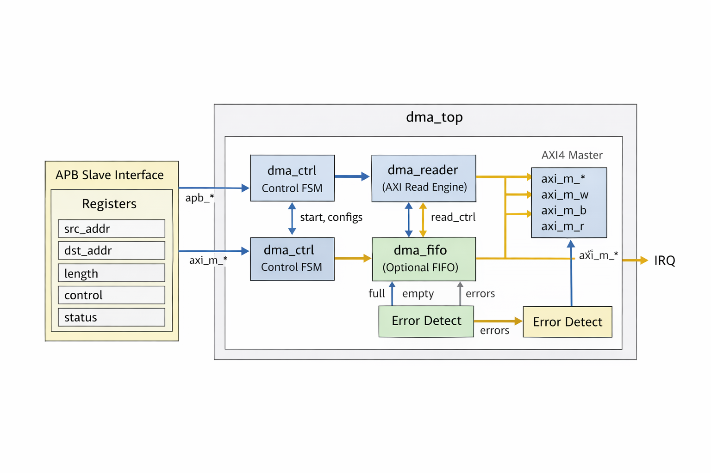
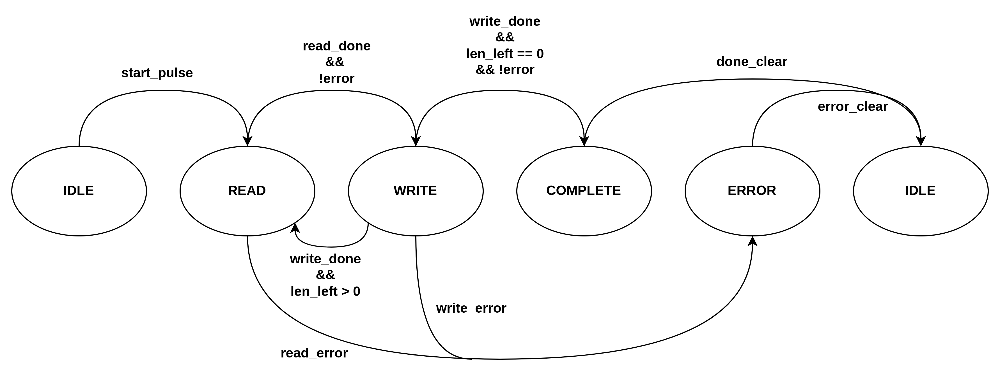

# AXI4 DMA Controller Design Specification

## Overview
The AXI4 DMA Controller is a hardware IP block that autonomously transfers a block of data from one memory location to another using an AXI4 bus, under the configuration of a processor via an APB interface. It performs single one-shot memory-to-memory data moves, offloading the CPU from byte-by-byte copy tasks. Key features include:

- **APB Slave Control Interface**: A simple 32-bit APB interface is used to program control registers (source address, destination address, transfer length, control/status) and to monitor status.
- **AXI4 Master Data Transfers**: Uses an AXI4 memory-mapped master port to read from the source address and write to the destination address. Only **incremental bursts** (INCR type) are used, with a fixed burst length of 4 beats for efficiency.
- **Aligned Transfers**: Source and destination addresses must be aligned to the data width (e.g. 4-byte word aligned for a 32-bit AXI data bus). This controller issues only word-aligned AXI transactions. (If unaligned addresses are provided, the controller will flag an error and abort the transfer.)
- **Fixed Burst Size (4-beat):** Data is transferred in bursts of 4 data beats (e.g. 4 words per burst). The controller automatically breaks the total transfer into as many 4-beat AXI bursts as needed, and uses a shorter burst for any remaining bytes at the end. Bursts are managed so that they do **not cross 4KB address boundaries**, in compliance with AXI4 protocol. If the transfer region crosses a 4KB boundary, the DMA will split the transfer into two bursts at the boundary.
- **Transfer Length**: Programmable transfer length in bytes. The length is fixed for each DMA operation (one-shot); once the DMA starts, it will transfer exactly the programmed number of bytes and then stop. (Optionally, software should ensure the length is a multiple of the data bus width to avoid partial word issues, otherwise the controller will handle the last partial word with proper strobe signals.)
- **Internal FIFO Buffer**: Contains a small internal FIFO to buffer data between the AXI read and write operations. This allows the read bursts and write bursts to be decoupled, improving throughput. The FIFO ensures that read data can be temporarily stored before being written out, and vice versa. The controller will only issue an AXI read when there is space in the FIFO for a full burst, and only issue an AXI write when the FIFO has a full burst of data available. This prevents stalling the AXI bus mid-burst due to FIFO underflow/overflow.
- **Status and Interrupts**: Status registers indicate when the DMA is busy or finished. An IRQ output is provided to signal completion (or error) to the processor. The interrupt is level-high, and is asserted when the transfer completes or an error occurs (if interrupts are enabled). It remains asserted until software clears the condition in the status register.
- **Simple FSM Control**: The DMA engine is implemented with a clear finite state machine (FSM) with states: **IDLE, WAIT_START, READ, WRITE, and COMPLETE**. This FSM orchestrates the transfer sequence, from waiting for a start trigger, through reading and writing bursts, to finishing and interrupt notification.

## Architecture and Interfaces

### High-Level Architecture
The AXI4 DMA controller consists of the following major components (see block diagram below):
- **APB Slave Interface & Registers:** Receives programming from the CPU. Contains the configuration registers (source address, destination address, length, control, status). Also synchronizes the start command into the DMA clock domain if necessary.
- **Control FSM**: A finite state machine that controls the progress of the DMA transfer. It loads the configured addresses and length when started, then sequences through read and write operations. The FSM transitions through IDLE, WAIT_START, READ, WRITE, and COMPLETE states (described in detail in the next section).
- **AXI4 Master Interface:** Issues read and write transactions on the AXI4 bus to perform the data movement. This includes an AXI Read Address channel (AR), AXI Read Data channel (R), AXI Write Address channel (AW), AXI Write Data channel (W), and AXI Write Response channel (B). The DMA acts as an AXI4 master to the system memory:
  - **Data Width:** 32-bit (word) data bus (configurable in RTL parameters). Byte addressing is used on AXI.
  - **Burst Length:** Fixed at 4 beats (except possibly the final burst). For full bursts, AXI AxLEN = 3 (meaning 4 transfers per burst). All bursts use AxBURST=INCR mode.
  - **Burst Alignment:** The controller aligns bursts to not cross 16-byte (4-beat) boundaries when possible, and never crosses a 4KB boundary. If the source or destination start address is not aligned to a 16-byte boundary, the first burst may be reduced so that subsequent bursts start at a 16-byte aligned address. Similarly, the final burst may be shorter if the remaining data is less than a full 4-beat burst.
  - **AXI IDs & Ordering:** The DMA uses a single AXI ID for all transactions (no out-of-order completion issues). It issues one burst at a time (no multiple outstanding bursts, for simplicity).
  - **Byte strobes:** The WSTRB signals on the AXI Write channel are used to mask any unused bytes in the last beat of the last burst if the transfer length is not a multiple of the bus width. This ensures that only the requested bytes are actually written to the destination.
- **Internal FIFO Buffer:** A small SRAM or register-based FIFO that stores data between AXI reads and writes. For example, the FIFO might be 16 words deep (to hold several bursts of data). The read logic pushes data into the FIFO; the write logic pulls data from it. This decoupling allows the read and write phases to overlap: the DMA can start writing one burst from the FIFO while simultaneously the next burst of read data is being fetched into the FIFO (if the FIFO depth allows). To maintain high throughput, the controller checks FIFO level: it will only start a read burst when the FIFO has space for an entire burst, and only start a write burst when the FIFO has at least one burst of data available.
- **Interrupt Logic:** A simple interrupt generator drives the IRQ output. When the transfer is complete or if an error condition occurs, a status flag is set and, if enabled, the IRQ line is asserted (held high). The IRQ is level-triggered (not pulsed) and is cleared when software writes to clear the status flag. This ensures the CPU will see the interrupt until it has serviced it and acknowledged the completion.

### APB Slave Interface
The controller’s APB slave interface conforms to the AMBA APB3/APB4 protocol for register access. Key aspects of the APB interface:
- **Addressing:** The APB PADDR is used to select the internal registers (word-aligned addresses for each register, see Register Map). Only 32-bit aligned word accesses are supported for register reads/writes.
- **Operations**: The CPU (or host) performs write operations to configure the DMA and a read operation to check status. PWRITE, PSEL, PENABLE, etc., are used as per APB standard handshake. The DMA responds with PREADY and PSLVERR (if an unsupported access is attempted, e.g. unaligned or reserved register, it can return an error).
- **Clock & Reset**: The APB interface shares the same clock as the DMA core (clk) in this design (for simplicity). A synchronous active-low reset (rst_n) resets the DMA registers and state machine.
- **Register Access Timing**: All registers (except the FIFO data path) are simple memory-mapped registers. Writing to the control register's START bit will initiate the DMA after the current APB cycle. The status register provides current state of the DMA (busy, done, etc.) and is updated by the hardware. APB reads of status are typically non-blocking (they reflect the momentary status). If the DMA is busy, configuration registers should not be altered until it completes or is aborted.

### AXI4 Master Interface
The AXI master port initiates all reads and writes to memory for the DMA transfer:
- **Read channel (AXI AR/R)**: The DMA issues AR (address) transactions to the source address. The ARVALID/ARREADY handshake is used to request a read. The address (ARADDR) and burst length (ARLEN) are determined by the current source pointer and the remaining transfer length. Typically, ARLEN=3 for a 4-beat burst. If fewer than 4 beats remain or an address alignment boundary is approaching, a smaller ARLEN is used. The size (ARSIZE) is fixed to the bus width (e.g. 4 bytes for 32-bit data) and burst type (ARBURST) is INCR (incrementing address). The DMA asserts RREADY to receive data. For each beat, it captures RDATA into the FIFO. It also monitors RRESP for any read errors. The read burst is complete when the last beat (RLAST) is received. The read address generator will increment the internal source address pointer by the number of bytes read.
- **Write channel (AXI AW/W/B)**: The DMA issues AW transactions to the destination address similarly. AWADDR and AWLEN are set based on the current destination pointer and remaining data. AWLEN is usually 3 for a 4-beat burst (or smaller for the final burst). AWSIZE is fixed (e.g. 4 bytes), AWBURST=INCR. The DMA then sends out WDATA beats, which it takes from the internal FIFO. It asserts WVALID for each beat, and sets WLAST on the final beat of the burst. The WSTRB signals are all '1's for full words, and for the very last beat of the entire transfer, WSTRB may have a subset of bits high if the transfer length is not an exact multiple of word size (to write only the valid bytes). The write address pointer is incremented internally. After all beats, the DMA waits for BVALID/BRESP (write response). A BRESP indicating OKAY confirms the burst was accepted; any SLVERR/DECERR indicates a write error. The DMA will set an error flag if BRESP or RRESP indicate an error on any transaction.
**AXI Protocol Compliance:** The controller ensures it meets AXI4 requirements for bursts. Notably, no burst crosses a 4KB boundary. If the next 4-beat burst would cross a 0x...FFF to 0x...000 boundary, the DMA will limit the burst length to stop at the 4KB limit and start a new burst at the boundary. The controller also never issues a new AXI address phase until the previous burst is fully completed (to keep design simple, only one outstanding burst on each channel). This means at most one read and one write burst can be in flight (the read and write might overlap in time if one is finishing while the other starts, but the FSM controls this as described below).

### Internal FIFO Buffer
The internal FIFO is a crucial component to decouple read and write operations:

- **Depth and Width**: The FIFO width equals the AXI data width (e.g. 32 bits). Depth could be, for example, 8 or 16 words (sufficient to hold a full burst or more). In this design, assume a depth of 8 words (32 bytes) for illustration.
- **Usage**: Data flows into the FIFO from the AXI read channel, and flows out of the FIFO into the AXI write channel. This allows the DMA to store data from a read burst until a write burst can transmit it. If the AXI read is faster or if the write is momentarily back-pressured, the FIFO provides buffering.
- **Flow Control:** The control FSM monitors FIFO fill level:
  - It will only launch a read burst if the FIFO has space for an entire burst of data (to avoid overflow). For a 4-beat burst, the FIFO must have at least 4 free entries before starting the read.
  - It will only launch a write burst if the FIFO has at least one burst-worth of data available (to avoid underflow during the burst). This ensures once a write burst begins, the FIFO can supply all beats without stalling. In other words, the DMA will not assert WVALID for a beat unless data is ready, so by guaranteeing a burst of data is queued, WVALID can remain asserted for the whole burst without wait states.
- **Overlap**: With the FIFO, the DMA can overlap operations: e.g., it might start issuing the write burst for chunk N while the read burst for chunk N+1 is happening in parallel, as long as the FIFO has room and data. However, for simplicity, our FSM design alternates read and write phases for each burst (it completes a read burst, then immediately completes the corresponding write burst). Overlap between consecutive bursts is minimal in this simple implementation, but the FIFO still helps to buffer any timing differences between the read and write transactions.

### Finite State Machine (FSM) Operation
The DMA controller’s operation is governed by a finite state machine with the following states:

- **IDLE**: Default state when the DMA is idle (no transfer in progress). In this state, the controller waits for a start condition. The control registers (source, dest, length) can be written by the CPU when the DMA is idle. The BUSY status bit is 0 in this state. Transition: On the CPU setting the START bit (via APB write to the control register), the FSM will latch the provided source address, destination address, and length into internal counters and move to the next state (WAIT_START).
- **WAIT_START**: (Optional transient state) This state handles the initiation of the DMA transfer. It may be implemented to synchronize the start trigger or to perform any initial checks (e.g., ensure addresses are aligned and length > 0). In practice, the WAIT_START state will immediately transition to READ if the DMA can start. (If an error is detected, e.g. misaligned address, the FSM would set the ERROR flag and return to IDLE without doing anything.)
- **READ**: In the READ state, the controller issues an AXI read burst from the current source address. The steps in this state:
  - Assert ARVALID with ARADDR = current source pointer, ARLEN = appropriate burst length (typically 3 for a 4-beat burst, or smaller if fewer bytes remain). Wait for ARREADY handshake.
  - Receive data beats on R channel, pushing each word into the FIFO (increment FIFO write pointer). Assert RREADY each cycle to accept data. On receiving RLAST of this burst, deassert RREADY after accepting the data.
  - Monitor RRESP for errors; if an AXI read error (SLVERR/DECERR) is signaled on any beat, set the ERROR flag (and later trigger interrupt if enabled). The FSM may decide to abort further operation on error.
  - Update internal source address register by adding the number of bytes read (e.g., +16 for a full 4-beat burst). Decrement the remaining length counter by the number of bytes read.
  - Transition: Once the burst is done (all beats received into FIFO), move to the WRITE state.
- **WRITE**: In the WRITE state, the controller takes data from the FIFO and writes it out to the destination address via AXI:
  - Assert AWVALID with AWADDR = current destination pointer, AWLEN = burst length (matches the read burst length that filled the FIFO segment). Wait for AWREADY.
  - For each beat of the burst, present WDATA from the FIFO and assert WVALID. The FIFO is read (pop) for each beat. Set WLAST on the last beat. WSTRB is all 1's for full words, except possibly on the very final transfer's last beat (if the total byte count is not a multiple of 4, the corresponding WSTRB bits will be 0 for the unused bytes).
  - Wait for WREADY handshakes for each beat; if the AXI slave cannot accept data (WREADY=0), the DMA will naturally stall on that beat (holding WVALID and the data stable until WREADY=1). The FIFO read pointer only advances when each beat is accepted.
  - After the last beat, wait for the write response: monitor BVALID/BRESP. When BVALID is high, capture BRESP. If BRESP indicates an error, set the ERROR flag. Assert BREADY to complete the handshake.
  - Update internal destination address by the number of bytes written. Decrement the remaining length counter by the bytes written in this burst (this should match what was read).
 -  Transition: If there are still bytes remaining (length counter > 0 after this burst), the FSM goes back to READ state to process the next chunk. If this burst was the last (remaining length is now 0), transition to COMPLETE state.

- **COMPLETE**: In this state, the DMA has finished transferring all requested data. The FSM performs completion tasks: it will deassert the internal "busy" flag, set the "done" flag in the status register, and assert the IRQ output (if interrupts are enabled) to signal completion. The DMA might remain in the COMPLETE state until the CPU acknowledges (for example, by clearing the done flag), or it might automatically transition back to IDLE after flagging completion. In this design, once done, the FSM immediately returns to IDLE state but the **DONE** status bit remains set (sticky) until software clears it. The IRQ line is level-sensitive, so it stays high as long as DONE is true (and IE is enabled). Software should read the status and then clear the DONE flag, upon which the IRQ will deassert and the controller is fully back to IDLE, ready for the next transfer.

**Error Handling:** If an error condition occurs (e.g., misaligned address, AXI bus error), the controller will set the **ERROR** status flag and typically halt the transfer:

- If error happens during READ or WRITE, the FSM will likely move to an error sub-state or directly to COMPLETE (with ERROR flag set). Any partial data in FIFO will be discarded or not written.
- The IRQ will be asserted (if enabled) to notify the CPU of the error. The BUSY flag will be cleared once the controller halts.
- Software can read the status (which will show ERROR=1, DONE may or may not be set in this case, but we can treat the error as a form of completion for this one-shot operation). The software should then clear the ERROR (and DONE if set) by writing to the status register, and reset/reinitialize the DMA if needed.

The FSM bubble diagram looks as follows:

### Register Map
The DMA controller's registers are accessed via the APB interface. All registers are 32-bit wide and aligned to 4-byte boundaries. The table below summarizes the register map:

### Register Map

| Offset | Name        | Width   | Access | Description |
|--------|-------------|---------|--------|-------------|
| 0x00   | SRC_ADDR    | 32-bit  | R/W    | Source address (must be word-aligned) |
| 0x04   | DST_ADDR    | 32-bit  | R/W    | Destination address (must be word-aligned) |
| 0x08   | LENGTH      | 32-bit  | R/W    | Transfer length in bytes (must be > 0) |
| 0x0C   | CONTROL     | 32-bit  | R/W    | Start + IRQ enable |
| 0x10   | STATUS      | 32-bit  | R/W*   | Status flags: busy, done, error, irq |

<!-- Additional registers (0x14 and above) could be defined for extended features (e.g., FIFO levels, error codes), but are not used in this basic design. For now, addresses 0x14-0x3C are reserved. -->

| 0x14-0x3C | Reserved | - | - | Reserved for future use. Reading returns 0, writing has no effect. |

### CONTROL Register (0x0C)

| Bit  | Name    | Access | Description |
|------|---------|--------|-------------|
| 0    | START   | W      | Write 1 to trigger transfer (self-clears) |
| 1    | IE      | R/W    | Interrupt enable |
| 31:2 | —       | —      | Reserved (write 0) |

### STATUS Register (0x10)

| Bit  | Name     | Access | Description |
|------|----------|--------|-------------|
| 0    | BUSY     | R      | Transfer in progress |
| 1    | DONE     | R/W1C  | Transfer complete (write 1 to clear) |
| 2    | ERROR    | R/W1C  | Transfer error occurred (write 1 to clear) |
| 3    | IRQ      | R      | IRQ line is asserted |
| 31:4 | —        | —      | Reserved |

*Note: R/W1C = Read/Write-One-to-Clear (write 1 to clear bit)

### Register Usage Notes:

- Software should only assert START when the DMA is idle (BUSY=0). If START is written while BUSY=1 (a transfer in progress), the controller will ignore the command (or optionally set an ERROR). There is no auto-reload or queueing of a next transfer in this simple design.
- The SRC_ADDR, DST_ADDR, and LENGTH registers should not be modified during an ongoing transfer. They should be configured prior to setting START. Changing them mid-transfer has no effect on the current transfer (the DMA internally uses latched copies of these at start) and could corrupt the next operation.
- When a transfer completes (DONE=1) or is aborted due to error (ERROR=1), software must write to STATUS to clear those flags before starting a new transfer. If DONE/ERROR remain set, the DMA treats that as an indication the last transfer isn’t acknowledged yet. Typically, the sequence is: handle interrupt (if used), read status to determine if DONE or ERROR, then write back the same bits (1s to those bits) to clear. Only then write CONTROL.START again for a new operation.
- The interrupt (IRQ) output is a combinational output that is high when (DONE || ERROR) && IE. It is level-triggered (high until cleared). If the CPU is using interrupts, it should service the DMA ISR when IRQ is high, then in the ISR read STATUS, clear the flags accordingly. If using polling, the CPU can periodically read STATUS.DONE or STATUS.ERROR bits.

### Example Operation Sequence

Below is an example of how a DMA transfer is initiated and completed from a software perspective:

1. **Configuration**: The CPU (or testbench driver) writes the source address, destination address, and transfer length to the respective APB registers. For example:
   - Write SRC_ADDR = 0x0010_0000 (example source physical address).
   - Write DST_ADDR = 0x0020_0000 (example destination address).
   - Write LENGTH = 256 (number of bytes to copy).
2. **Start Command**: The CPU writes CONTROL with the START bit set (and IE if an interrupt is desired). For instance, write CONTROL = 0x01 to start (assuming IE=0 for polling, or 0x03 to start with IE=1 to enable interrupt). This triggers the DMA FSM to leave IDLE and begin the transfer. The CONTROL.START bit auto-clears immediately, and STATUS.BUSY is set to 1 to indicate the DMA is now active.
3. **DMA In Progress**: The controller enters the READ/WRITE cycle. It issues AXI read bursts from address 0x0010_0000 to 0x0010_00FF (covering 256 bytes in chunks of 16 bytes per burst). Data is buffered and then written out in bursts to 0x0020_0000...0x0020_00FF. During this time, the APB STATUS register shows BUSY=1. If the CPU polls BUSY, it will see it set. If an interrupt was enabled, the CPU can sleep until an IRQ is received.
4. **Completion**: After the DMA has moved all 256 bytes, it goes to COMPLETE. It sets STATUS.DONE = 1, clears BUSY to 0, and (if IE=1) asserts the IRQ line high. At this point, the memory at 0x0020_0000...0x0020_00FF has the copied data.
5. **CPU Response**: If using interrupt, the CPU receives the IRQ and enters the DMA ISR. If polling, the CPU would detect STATUS.DONE = 1 (and BUSY=0) in its loop. The CPU reads the STATUS register to confirm DONE=1 and ERROR=0 (no error). It then writes a '1' to the DONE bit (and any error bit if set) to clear them. For example, writing value 0x02 to STATUS clears the DONE flag. This action also deasserts the IRQ line. The DMA is now back in idle state with all status flags clear.
6. **Result Verification**: (Typically done in software or by a testbench) the data in the destination region is verified to match the source data. In our example, bytes at 0x0020_0000..0x0020_00FF should exactly equal those from 0x0010_0000..0x0010_00FF.
7. **Next Transfer**: The DMA is ready for another transfer. The CPU can program new SRC_ADDR, DST_ADDR, LENGTH and set START again for the next block move.

If an error had occurred during the transfer (for example, if the AXI read returned a DECERR because the source address was unmapped), the sequence would be: STATUS.ERROR set to 1, BUSY=0, IRQ asserted (if IE=1). The CPU would detect ERROR (and likely no DONE), then clear the ERROR flag. The DMA would be idle and not have completed the full length of data (partial transfer possible). Software could handle this as needed (retry or report error).

